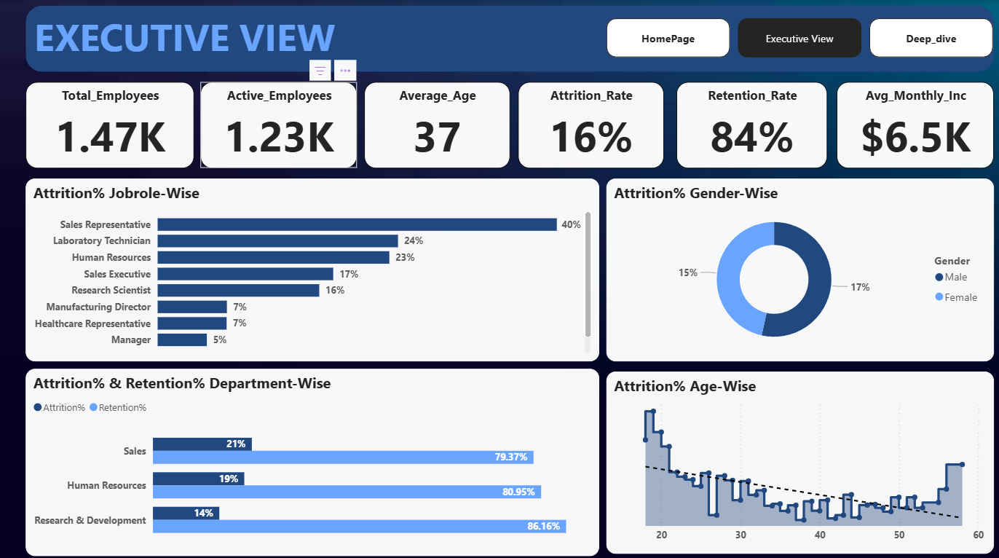
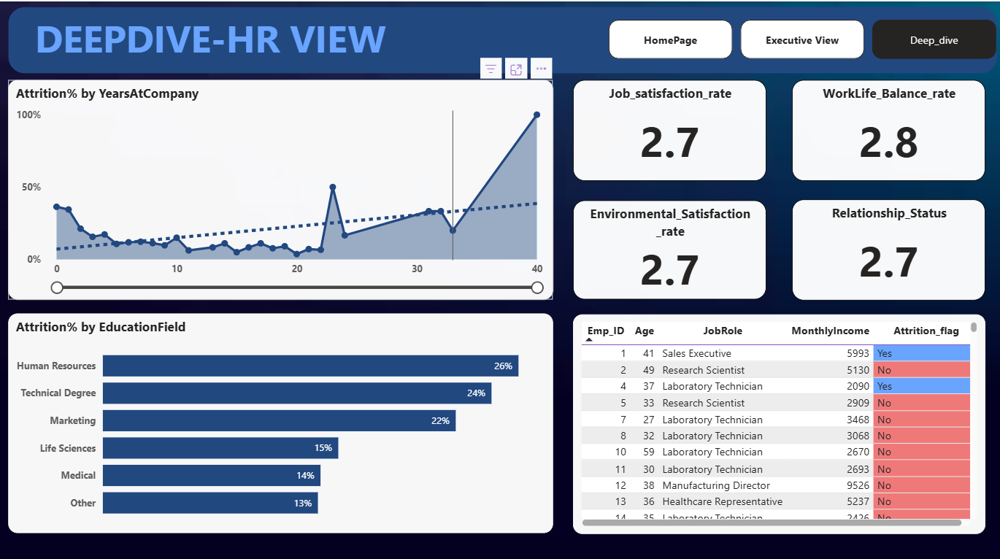

# 📊 HR Analytics Dashboard  

This Power BI dashboard provides insights into **employee attrition, demographics, and workforce trends**.  

## 🔹 Features  
- Attrition analysis by age, gender, education, and department  
- Employee demographics overview  
- Salary & job role insights  

## 🛠️ Tools Used  
- Power BI  
- Sample HR Dataset  

## 📸 Dashboard Preview  
  
  

## 📂 Files  
- `HR_Analytics.pbix` → Full interactive dashboard  
- `dataset/` → Sample dataset (if sharable)  

## 🚀 How to Use  
1. Clone this repo  
2. Open `HR_Analytics.pbix` in Power BI Desktop  
3. Explore the interactive visuals  
